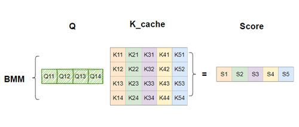
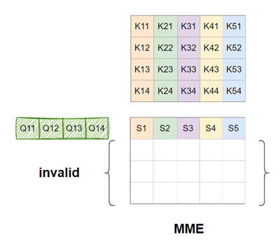

# G2

G2 is a **TPC**([Tensor Processor Cpre](https://docs.habana.ai/en/latest/TPC/index.html?highlight=TPC)) optimized attention lib for transformer decoder on Intel Gaudi2.

## Usage

### build from source

- clone source code in Intel Gaudi2 docker

```bash
git clone https://github.com/ZhaiFeiyue/g2.git
```

- build

```bash
pip install .
```

### install from github

```bash
pip install git+https://github.com/ZhaiFeiyue/g2.git#egg=g2attn
```

## Run test

```bash
cd tests
./run.sh
```

## Motivation

QK bmm of transformer decoder could be illustrated in the following picture


The ***Q*** shape is [`B`, `M`, `1`, `H`], the ***K*** shape is [`B`, `M`, `T`, `H`] and the output shape is [`B`, `M`, `1`, `T`].

where:

- ***B*** is the Batch Size.
- ***M*** is the number of head.
- ***H*** is head dimention
- ***T*** is the number of cached tokens for ***K***.

[Intel Gaudi2](https://habana.ai/?utm_term=&utm_campaign=PMax-+Google&utm_source=adwords&utm_medium=ppc&hsa_acc=1034914560&hsa_cam=21089989807&hsa_grp=&hsa_ad=&hsa_src=x&hsa_tgt=&hsa_kw=&hsa_mt=&hsa_net=adwords&hsa_ver=3&gad_source=1&gclid=EAIaIQobChMIueWkksSFhQMVAwetBh3LJAM3EAAYAiAAEgIIqPD_BwE) is a [Systolic array](https://en.wikipedia.org/wiki/Systolic_array) based AI Accelerators, and the peek tops is ~410T for BF16. But when calculate QK Bmm(same on ScoreV Bmm), the valid tops is only 3.2T, since the valid row of Q is only one, see following.



So this project aims to tackle the above problem by leverage the tops of TPC.

## Benchmark

### Llama2-7B QK BMM

|BS     |Head   |KV length  |Head Dim   |Dtype  |TPC latency(us)    |MME latency(us)    |
|--:    |--:    |--:        |--:        |--:    |--:                |--:                |
|64     |32     |128        |128        |BF16   |63                 |41                 |
|64     |32     |256        |128        |BF16   |62                 |77                 |
|64     |32     |512        |128        |BF16   |126                |69                 |
|64     |32     |1024       |128        |BF16   |244                |192                |
|64     |32     |2048       |128        |BF16   |498                |467                |
|64     |32     |4096       |128        |BF16   |1007               |935                |
|64     |32     |8192       |128        |BF16   |2011               |1894               |

### Llama2-7B ScoreV BMM

|BS     |Head   |KV length  |Head Dim   |Dtype  |TPC latency(us)    |MME latency(us)    |
|--:    |--:    |--:        |--:        |--:    |--:                |--:                |
|64     |32     |128        |128        |BF16   |63                 |42                 |
|64     |32     |256        |128        |BF16   |123                |81                 |
|64     |32     |512        |128        |BF16   |247                |160                |
|64     |32     |1024       |128        |BF16   |482                |311                |
|64     |32     |2048       |128        |BF16   |981                |639                |
|64     |32     |4096       |128        |BF16   |1965               |1279               |
|64     |32     |8192       |128        |BF16   |3911               |2539               |

## Know issue

- not support release >1.12
